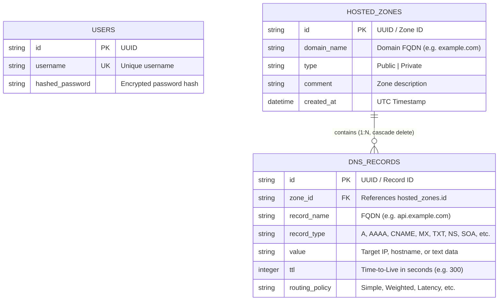

# 🌐 AWS Route 53 Clone — Enterprise Cloud DNS Web Application

A full-stack, enterprise-grade DNS and Domain Management web application inspired by **AWS Route 53**. Built with **Next.js 16 (App Router)**, **TypeScript**, **Tailwind CSS**, **FastAPI**, and **SQLAlchemy**.

Designed to work across all device form factors (mobile, tablet, and desktop) with native AWS Management Console aesthetics, dark mode support, and an interactive CloudShell terminal.

---

## 📌 Table of Contents

- [Features](#-features)
  - [Core DNS Management](#core-dns-management)
  - [Bonus Capabilities](#bonus-capabilities)
- [Architecture Overview](#-architecture-overview)
  - [System Architecture Diagram](#system-architecture-diagram)
  - [Tech Stack](#tech-stack)
- [Database Schema](#-database-schema)
  - [Entity-Relationship Diagram](#entity-relationship-diagram)
  - [Table Specifications](#table-specifications)
- [API Overview & Endpoints](#-api-overview--endpoints)
  - [Authentication](#1-authentication)
  - [Hosted Zones](#2-hosted-zones)
  - [DNS Records](#3-dns-records)
  - [BIND Import & Export](#4-bind-zone-import--export)
  - [Bulk Operations](#5-bulk-operations)
- [Setup & Installation Instructions](#-setup--installation-instructions)
  - [Prerequisites](#prerequisites)
  - [Option A: Quick Start (Windows)](#option-a-quick-start-windows)
  - [Option B: Docker / Container Deployment](#option-b-docker--container-deployment)
  - [Option C: Manual Local Setup](#option-c-manual-local-setup)
- [Environment Variables](#-environment-variables)
- [Keyboard Shortcuts Cheatsheet](#-keyboard-shortcuts-cheatsheet)
- [License](#-license)

---

## 🚀 Features

### Core DNS Management
- **Hosted Zones Lifecycle:**
  - Create, inspect, update, and delete **Public** and **Private** Hosted Zones.
  - Automatic generation of authoritative Name Server (`NS`) delegation sets (4 anycast nameservers) and Start of Authority (`SOA`) records upon zone creation.
- **DNS Records Management:**
  - Full CRUD operations supporting standard record types: `A`, `AAAA`, `CNAME`, `MX`, `TXT`, `NS`, `SOA`, `SRV`, `PTR`, `CAA`.
  - Configurable Time-to-Live (TTL) values.
  - Routing policy selection (`Simple`, `Weighted`, `Latency`, `Failover`, `Geolocation`, `Multivalue Answer`).
- **Interactive Top Panel:**
  - **AWS Services Mega-Menu:** Filter and navigate across AWS service categories (Compute, Networking, Storage, Database, Security).
  - **Global Search Console (`Alt+S` / `/`):** Quick jump command palette finding hosted zones, records, and AWS services in real-time.
  - **AWS CloudShell Terminal:** Embedded bottom-drawer terminal emulator supporting `aws route53` CLI commands and `dig` simulations.
  - **AWS Notification Center:** Real-time badge counter and notification drawer tracking DNS propagation status and health checks.
  - **Region Selector:** Global Anycast default with multi-region selector.
  - **Account Dropdown:** IAM account identification (`1234-5678-9012`), role credentials, and secure sign-out.
  - **Console Preferences Modal:** Visual theme toggle, row density switcher, and keyboard shortcut access.
- **Interactive Tab Slider:**
  - Seamless animated sliding indicator transitioning between the **Records** view and **Hosted Zone Details** view.
  - Displays full zone delegation sets, SOA timers, VPC associations, and metadata.

### Bonus Capabilities
- **Import BIND Zone Files:**
  - Upload `.zone` / `.txt` files or paste RFC 1035 zone text.
  - Built-in RFC 1035 parser supporting `$ORIGIN`, `$TTL`, multi-line parentheses, inline comments, and FQDN resolution with instant preview before commit.
- **Export Hosted Zones:**
  - One-click export to standard **RFC 1035 BIND zone files** (`.zone`) or structured **JSON** (`.json`).
- **Dark Mode Support:**
  - Authentic AWS Console dark mode (`#0d131f`, `#161f2e`, `#ff9900` accents).
  - Toggle via header preferences, settings modal, or `T` shortcut; persisted in `localStorage`.
- **Keyboard Shortcuts:**
  - Global hotkeys (`?`, `Alt+S`, `C`, `E`, `D`, `R`, `B`, `T`, `~`) with an interactive cheat sheet modal.
- **Bulk Operations:**
  - Bulk record deletion and batch zone deletion.
  - Bulk TTL modification across multiple selected DNS records in a single operation.
- **Responsive Multi-Device Layout:**
  - Clean scaling across mobile (<640px), tablet (640px–1024px), and desktop (1024px+).
  - Off-canvas collapsible sidebar drawer with backdrop overlay.
  - Horizontal scroll containers preventing table column squashing on small screens.
- **Progressive Web Application (PWA) & Docker Support:**
  - `manifest.json`, service worker caching, and multi-stage containerization via `docker-compose.yml`.

---

## 🏗️ Architecture Overview

### System Architecture Diagram

```
┌────────────────────────────────────────────────────────────────────────┐
│                        Client Web Browser                              │
│         (Desktop, Tablet, or Mobile Viewport / PWA Standalone)         │
└───────────────────────────────────┬────────────────────────────────────┘
                                    │ HTTP / REST API (Port 3000 / 8000)
                                    ▼
┌────────────────────────────────────────────────────────────────────────┐
│                      Next.js 16 (App Router) Frontend                  │
│  ┌──────────────────────────────────────────────────────────────────┐  │
│  │ Components: Header, Sidebar, CloudShell, Modals, Tab Slider      │  │
│  │ State: ConsoleContext (Theme, Shortcuts, Region, Table Density)  │  │
│  │ Styling: Tailwind CSS v4 + Amazon Ember Font System              │  │
│  │ PWA: manifest.json, sw.js service worker                         │  │
│  └──────────────────────────────────────────────────────────────────┘  │
└───────────────────────────────────┬────────────────────────────────────┘
                                    │ JSON Payloads (CORS configured)
                                    ▼
┌────────────────────────────────────────────────────────────────────────┐
│                        FastAPI Backend Server                          │
│  ┌───────────────────────────┐        ┌─────────────────────────────┐  │
│  │ API Endpoints (api/):     │        │ Services:                   │  │
│  │ - /api/auth               │        │ - bind_parser.py            │  │
│  │ - /api/hosted-zones       │◄───────┤   (RFC 1035 parser/gen)     │  │
│  │ - /api/hosted-zones/...   │        └─────────────────────────────┘  │
│  └─────────────┬─────────────┘                                         │
│                │ SQLAlchemy ORM Models                                 │
│                ▼                                                       │
│  ┌──────────────────────────────────────────────────────────────────┐  │
│  │ Database Layer: SQLite (Default) or PostgreSQL (Production)       │  │
│  │ Tables: users, hosted_zones, dns_records                         │  │
│  └──────────────────────────────────────────────────────────────────┘  │
└────────────────────────────────────────────────────────────────────────┘
```

### Tech Stack

| Layer | Technology | Description |
| :--- | :--- | :--- |
| **Frontend Framework** | [Next.js 16](https://nextjs.org/) (App Router) | React 19, TypeScript, Server & Client Components |
| **Styling & UI** | [Tailwind CSS v4](https://tailwindcss.com/) | Custom design tokens, CSS variables, dark mode |
| **Icons & Typography** | Google Material Symbols | Amazon Ember & Amazon Ember Mono font stacks |
| **Backend Framework** | [FastAPI](https://fastapi.tiangolo.com/) | High-performance Python async REST API framework |
| **ORM & Database** | [SQLAlchemy](https://www.sqlalchemy.org/) | SQLite database with PostgreSQL compatibility |
| **Validation** | [Pydantic v2](https://docs.pydantic.dev/) | Request and response schema validation |
| **Server** | [Uvicorn](https://www.uvicorn.org/) | Lightning-fast ASGI web server |
| **Containerization** | Docker & Docker Compose | Multi-stage production container deployment |

---

## 🗄️ Database Schema

### Entity-Relationship Diagram



### Table Specifications

#### 1. `users`
Stores authenticated users and credentials.
| Column | Type | Constraints | Description |
| :--- | :--- | :--- | :--- |
| `id` | `VARCHAR` | Primary Key, Index | Unique user identifier |
| `username` | `VARCHAR` | Unique, Index, Not Null | Login username |
| `hashed_password` | `VARCHAR` | Not Null | Hashed credential |

#### 2. `hosted_zones`
Stores authoritative public and private DNS hosted zones.
| Column | Type | Constraints | Default | Description |
| :--- | :--- | :--- | :--- | :--- |
| `id` | `VARCHAR` | Primary Key, Index | `UUID4` | Unique zone identifier |
| `domain_name` | `VARCHAR` | Index, Not Null | — | Domain name (e.g., `example.com`) |
| `type` | `VARCHAR` | Not Null | `'Public'` | `'Public'` or `'Private'` zone |
| `comment` | `VARCHAR` | Nullable | `NULL` | Zone description or metadata |
| `created_at` | `DATETIME` | Not Null | `utcnow()` | Zone creation timestamp |

*Relationship:* One-to-many with `dns_records` (cascade delete on removal).

#### 3. `dns_records`
Stores individual resource record sets associated with a hosted zone.
| Column | Type | Constraints | Default | Description |
| :--- | :--- | :--- | :--- | :--- |
| `id` | `VARCHAR` | Primary Key, Index | `UUID4` | Unique record identifier |
| `zone_id` | `VARCHAR` | Foreign Key (`hosted_zones.id`) | — | Parent hosted zone reference |
| `record_name` | `VARCHAR` | Index, Not Null | — | FQDN (e.g., `www.example.com`) |
| `record_type` | `VARCHAR` | Not Null | — | `A`, `AAAA`, `CNAME`, `MX`, `TXT`, `NS`, `SOA`, `SRV`, `PTR`, `CAA` |
| `value` | `VARCHAR` | Not Null | — | Record targets, IP addresses, or strings |
| `ttl` | `INTEGER` | Not Null | `300` | Time-to-Live in seconds |
| `routing_policy`| `VARCHAR` | Not Null | `'Simple'` | Routing configuration |

---

## 📡 API Overview & Endpoints

Base URL: `http://localhost:8000/api` (Interactive Swagger Docs: `http://localhost:8000/docs`)

### 1. Authentication
| Method | Endpoint | Description | Request Body | Response |
| :--- | :--- | :--- | :--- | :--- |
| `POST` | `/auth/login` | Authenticate IAM user | `{"username": "...", "password": "..."}` | `{"token": "...", "username": "..."}` |
| `POST` | `/auth/logout` | Revoke session | — | `{"ok": true}` |

### 2. Hosted Zones
| Method | Endpoint | Description | Request Body | Response |
| :--- | :--- | :--- | :--- | :--- |
| `GET` | `/hosted-zones` | List all hosted zones | — | `List[HostedZone]` |
| `POST` | `/hosted-zones` | Create a hosted zone (auto-creates NS & SOA) | `{"domain_name": "...", "type": "Public", "comment": "..."}` | `HostedZone` |
| `GET` | `/hosted-zones/{zone_id}` | Retrieve hosted zone details | — | `HostedZone` |
| `PUT` | `/hosted-zones/{zone_id}` | Update hosted zone metadata | `{"domain_name": "...", "type": "...", "comment": "..."}` | `HostedZone` |
| `DELETE`| `/hosted-zones/{zone_id}` | Delete a hosted zone and records | — | `{"ok": true}` |

### 3. DNS Records
| Method | Endpoint | Description | Request Body | Response |
| :--- | :--- | :--- | :--- | :--- |
| `GET` | `/hosted-zones/{zone_id}/records` | List DNS records for a zone | — | `List[DNSRecord]` |
| `POST` | `/hosted-zones/{zone_id}/records` | Create a DNS record | `{"record_name": "...", "record_type": "A", "value": "...", "ttl": 300, "routing_policy": "Simple"}` | `DNSRecord` |
| `PUT` | `/hosted-zones/{zone_id}/records/{record_id}` | Update a DNS record | `{"record_name": "...", "record_type": "...", "value": "...", "ttl": 300, "routing_policy": "Simple"}` | `DNSRecord` |
| `DELETE`| `/hosted-zones/{zone_id}/records/{record_id}` | Delete a DNS record | — | `{"ok": true}` |

### 4. BIND Zone Import & Export
| Method | Endpoint | Description | Parameters / Body | Response |
| :--- | :--- | :--- | :--- | :--- |
| `POST` | `/hosted-zones/{zone_id}/import-bind` | Parse and import BIND RFC 1035 zone text | `{"zone_content": "$ORIGIN example.com.\n@ IN A 1.2.3.4..."}` | `List[DNSRecord]` |
| `GET` | `/hosted-zones/{zone_id}/export?format=bind` | Export zone as BIND RFC 1035 file | Query parameter `format=bind` | Raw `.zone` text file |
| `GET` | `/hosted-zones/{zone_id}/export?format=json` | Export zone as structured JSON | Query parameter `format=json` | JSON object with records |

### 5. Bulk Operations
| Method | Endpoint | Description | Request Body | Response |
| :--- | :--- | :--- | :--- | :--- |
| `POST` | `/hosted-zones/bulk-delete` | Batch delete multiple hosted zones | `{"zone_ids": ["id-1", "id-2"]}` | `{"ok": true, "deleted_count": 2}` |
| `POST` | `/hosted-zones/{zone_id}/records/bulk-delete` | Batch delete multiple DNS records | `{"record_ids": ["rec-1", "rec-2"]}` | `{"ok": true, "deleted_count": 2}` |
| `POST` | `/hosted-zones/{zone_id}/records/bulk-update-ttl` | Batch update TTL for selected records | `{"record_ids": ["rec-1", "rec-2"], "ttl": 3600}` | `{"ok": true, "updated_count": 2}` |

---

## 🛠️ Setup & Installation Instructions

### Prerequisites
- **Node.js:** v18.17.0+ (v20+ recommended)
- **Python:** v3.10+ (v3.11 recommended)
- **Package Managers:** `npm` / `pnpm` / `yarn` and `pip`
- **Docker & Docker Compose** *(optional, for container deployment)*

---

### Option A: Quick Start (Windows)

Double-click `start-dev.bat` in the repository root, or run:
```cmd
start-dev.bat
```
This automatically boots both the FastAPI backend on port 8000 and the Next.js frontend on port 3000.

---

### Option B: Docker / Container Deployment

To run both services in isolated production containers:
```bash
docker compose up --build
```
- Web Application Frontend: `http://localhost:3000`
- API Backend & Swagger Docs: `http://localhost:8000/docs`

---

### Option C: Manual Local Setup

#### 1. Backend Setup

1. Open a terminal and navigate to `backend/`:
   ```bash
   cd backend
   ```

2. Create and activate a Python virtual environment:
   - **Windows (PowerShell):**
     ```powershell
     python -m venv venv
     .\venv\Scripts\Activate
     ```
   - **macOS / Linux:**
     ```bash
     python3 -m venv venv
     source venv/bin/activate
     ```

3. Install required Python packages:
   ```bash
   pip install -r requirements.txt
   ```

4. Start the FastAPI development server:
   ```bash
   uvicorn app.main:app --reload --port 8000
   ```
   Backend will be running at `http://localhost:8000`.

#### 2. Frontend Setup

1. Open a new terminal and navigate to `frontend/`:
   ```bash
   cd frontend
   ```

2. Install dependencies:
   ```bash
   npm install
   ```

3. Start the Next.js development server:
   ```bash
   npm run dev
   ```
   Access the web application at `http://localhost:3000`.

---

## ⚙️ Environment Variables

### Frontend (`frontend/.env.local`)
| Variable | Description | Default |
| :--- | :--- | :--- |
| `NEXT_PUBLIC_API_BASE_URL` | Base URL pointing to the FastAPI backend API | `http://localhost:8000/api` |

### Backend (`backend/.env`)
| Variable | Description | Default |
| :--- | :--- | :--- |
| `DATABASE_URL` | SQLAlchemy connection string | `sqlite:///./route53_clone.db` |
| `CORS_ORIGINS` | Comma-separated list of allowed origins | `http://localhost:3000,http://127.0.0.1:3000` |
| `HOST` | Bind host address | `0.0.0.0` |
| `PORT` | Bind port number | `8000` |

---

## ⌨️ Keyboard Shortcuts Cheatsheet

Press <kbd>?</kbd> anywhere in the application to open the on-screen cheatsheet.

| Shortcut | Action | Scope |
| :--- | :--- | :--- |
| <kbd>Alt</kbd> + <kbd>S</kbd> or <kbd>/</kbd> | Focus Global Search Command Palette | Global |
| <kbd>~</kbd> or <kbd>Ctrl</kbd> + <kbd>`</kbd> | Toggle AWS CloudShell Terminal Drawer | Global |
| <kbd>T</kbd> | Toggle Dark / Light Display Mode | Global |
| <kbd>?</kbd> | Open Keyboard Shortcuts Cheatsheet | Global |
| <kbd>Esc</kbd> | Close active drawer, modal, or dropdown menu | Global |
| <kbd>C</kbd> / <kbd>N</kbd> | Create Record (in Zone) or Create Hosted Zone (in Zones) | Page |
| <kbd>E</kbd> | Edit selected record or hosted zone | Page |
| <kbd>D</kbd> | Delete selected record(s) or hosted zone(s) | Page |
| <kbd>R</kbd> | Refresh table records from server | Page |
| <kbd>B</kbd> | Open BIND Zone File Import Modal | Zone Detail |

---

## 💻 CloudShell CLI Guide

Click the terminal icon <span className="material-symbols-outlined">terminal</span> in the top header or press <kbd>~</kbd> to launch AWS CloudShell. Sample commands:

```bash
# List all hosted zones
aws route53 list-hosted-zones

# List record sets for a specific hosted zone
aws route53 list-resource-record-sets --hosted-zone-id <zone-id>

# Create a new hosted zone via CLI
aws route53 create-hosted-zone --name myapp.io

# Perform simulated DNS query lookup
dig myapp.io A
dig myapp.io MX

# Check caller identity
whoami
```

---

## 📄 License

This project is open source and available under the [MIT License](LICENSE).
